# V1 Service Layer Design — CodeSphere

## Status: Frozen (Aligned with V1 Architecture)

This document defines the responsibilities, structure,
constraints, orchestration rules, and boundaries of the V1 Service Layer.

The Service Layer is the central application orchestrator.

It is:

- Framework-agnostic
- Persistence-agnostic
- Execution-agnostic (interface-based)
- Deterministic
- Authorization-enforcing
- Upgrade-stable

---

# 1. Purpose of Service Layer

The Service Layer exists to:

- Orchestrate use cases
- Enforce authorization
- Coordinate execution engine
- Coordinate repository operations
- Ensure atomic state transitions
- Protect architectural boundaries

It contains business logic.

It does NOT contain:

- Database queries
- File system access
- HTTP framework logic
- Execution implementation
- Authentication provider logic

---

# 2. Architectural Position

  

Service Layer depends only on:

- Repository interfaces
- ExecutionEngine interface
- Domain contracts
- Authorization module

It must not depend on:

- MongoDB driver
- Next.js
- Express
- File system
- Concrete execution implementation

---

# 3. Service Responsibilities (V1)

## 3.1 Problem Listing Service

Responsibilities:

- Load canonical problems via ProblemRepository
- Load user progress via ProgressRepository
- Merge view model
- Return enriched problem list

No execution.
No state mutation.

---

## 3.2 Problem Detail Service

Responsibilities:

- Load canonical problem
- Load user submission history
- Return combined view model

No mutation.

---

## 3.3 Submit Solution Service (Core Use Case)

This is the most critical service.

Responsibilities:

1. Validate authentication
2. Enforce authorization
3. Validate input constraints
4. Request execution from Execution Engine
5. Handle queue states
6. Persist submission
7. Update progress atomically
8. Return execution result

This service coordinates multiple layers safely.

---

# 4. Submission Service — Detailed Orchestration

## Step 1 — Identity Resolution

Input includes:

- Authenticated user identity
- problemId
- language
- sourceCode

If identity invalid → abort.

---

## Step 2 — Authorization Enforcement

Call:

requirePermission()

Must occur BEFORE:

- Execution
- Persistence
- State mutation

If denied → abort immediately.

---

## Step 3 — Input Guardrails

Validate:

- Problem exists
- Language supported
- Source size ≤ 100KB
- Execution mode valid

If invalid → abort.

---

## Step 4 — Execution Request

Call:

ExecutionEngine.execute(request)

Possible responses:

- QUEUED
- SUCCESS
- ERROR state
- REJECTED (queue full)

If REJECTED → return 429

If QUEUED → return queued state

If executed → continue

Service must not inspect internal test cases.

---

## Step 5 — Atomic Persistence

After execution completes:

Perform atomic write:

1. Create Submission
2. Update Progress

Allowed strategies:

- MongoDB transaction
  OR
- Idempotent write-safe logic

Never:

- Persist submission without progress update
- Update progress without submission record

---

## Step 6 — Response Mapping

Map ExecutionResult → API-safe response

Do not expose:

- Hidden test input
- Hidden expected output
- Internal engine errors

Return:

- overallStatus
- per-test status (IDs only)
- runtime metadata

---

# 5. Atomicity Rules

Submission + progress update must behave as single unit.

Failure cases:

If persistence fails:

- No partial state allowed
- No corrupted progress

Execution engine must not know about persistence.

---

# 6. Queue Awareness Rules

Service must handle:

- Immediate execution
- Queued state
- Rejected state (queue full)

Service does NOT:

- Implement queue logic itself
- Manage concurrency itself

Queue enforcement belongs to Execution Engine.

---

# 7. Error Handling Model

Service must normalize:

- Execution engine errors
- Repository failures
- Authorization failures

No stack traces leaked.

Structured error responses only.

---

# 8. What Is Explicitly Forbidden

Service layer must NEVER:

- Import MongoDB driver
- Access file system directly
- Execute child processes
- Bypass repository layer
- Skip authorization
- Embed framework logic
- Contain controller code
- Contain environment-specific code

Violation of these rules breaks architecture.

---

# 9. Determinism Contract

Service logic must not introduce:

- Randomness
- Time-based branching affecting result
- Non-deterministic state mutation

Service must preserve:

Same submission input → same execution → same persisted result.

---

# 10. Dependency Rules

Service Layer depends only on:

- Shared domain contracts
- Repository interfaces
- ExecutionEngine interface
- Authorization module

Dependency direction is one-way.

No circular dependencies allowed.

---

# 11. Testability Requirements

Service must be testable:

- Without HTTP layer
- Without MongoDB
- With mocked repository interfaces
- With mocked ExecutionEngine interface

Tests must verify:

- Authorization enforcement order
- Atomicity behavior
- Correct progress transitions
- Correct error propagation
- Correct queue handling

---

# 12. Upgrade Stability (V2)

V2 may introduce:

- Container-based execution
- Distributed queue
- Worker pool
- Asynchronous execution

Service Layer must remain unchanged.

ExecutionEngine implementation may change,
but interface contract must remain stable.

---

# 13. Service Layer Integrity Statement

V1 Service Layer is:

- Orchestration-only
- Deterministic
- Authorization-enforcing
- Repository-driven
- Execution-abstracted
- Upgrade-stable

It is the architectural control plane of CodeSphere V1.
