# V1 System Architecture — CodeSphere

## Status: Frozen (Aligned with Execution Engine V1)

This document defines the architectural boundaries, responsibilities,
data flow, and deterministic guarantees for CodeSphere V1.

V1 is intentionally single-user scale, process-based, and queue-controlled.
It is not container-isolated or horizontally scalable.

---

# 1. High-Level Architecture

  

Execution engine operates as a separate service boundary.

Frontend communicates with Service Layer only.

---

# 2. Content Boundary

## Canonical Problems

- Stored in `problem-bank/`
- Immutable at runtime
- Schema-validated at load
- Never stored in MongoDB
- Never bundled client-side
- Hidden tests never exposed

## Operational Data (MongoDB)

- Users
- Submissions
- Progress state
- Session data (if persisted)

No canonical duplication in database.

---

# 3. Layer Responsibilities

## Problem Bank

- Canonical, read-only content
- Deterministic test definitions
- Version-controlled
- No runtime mutation

---

## Repository Layer

- Abstracts persistence
- No business logic
- No authorization logic
- No evaluation logic
- Returns domain-validated objects

---

## Service Layer

- Orchestrates use cases
- Enforces authorization before mutation
- Coordinates evaluation
- Handles queue-aware submission flow
- Ensures atomic submission + progress update
- Framework-agnostic

Service layer does NOT:

- Execute code directly
- Access file system canonical tests directly
- Contain DB query logic

---

## Execution Engine

See: `execution_engine.md`

Core properties:

- Deterministic process-based execution
- Single concurrency slot
- Queue length max = 3
- Per-test timeout enforced
- Global timeout enforced
- Source size and input size limits enforced
- No DB awareness
- No user awareness
- No framework awareness

Execution engine is isolated by interface,
not by container sandboxing.

---

## API Layer

- Thin transport layer
- No business logic
- No DB queries
- Delegates entirely to Service Layer

If execution is queued:

- API returns queued state
- Frontend must display "Queued"

---

# 4. Submission Flow (Architectural Level)

1. User submits code.
2. API delegates to Service Layer.
3. Service validates:
   - Authentication
   - Authorization
   - Source size limit
4. Service sends request to Execution Engine.
5. Execution Engine:
   - Enqueues if busy
   - Executes deterministically
6. Service:
   - Persists submission
   - Updates progress atomically
7. Result returned to frontend.

---

# 5. Determinism Guarantee

Determinism ensured by:

- Immutable file-based problems
- Fixed test cases
- Strict output normalization
- No AI evaluation
- Single execution concurrency
- No randomized judging

Same input → same result.

---

# 6. Execution Queue Model

V1 execution capacity:

MaxConcurrentExecutions = 1
MaxQueueLength = 3

If queue full:

- Submission rejected (HTTP 429)

Queueing ensures:

- Bounded CPU usage
- Predictable latency
- Stability under moderate load

---

# 7. Architectural Constraints

- No canonical duplication in DB.
- No direct DB access outside repositories.
- No hidden test cases in client bundle.
- Authorization enforced before state mutation.
- Services are framework-agnostic.
- Execution engine must use argument arrays only.
- No shell interpolation allowed.
- Source code size capped.
- Test input size capped.

---

# 8. Isolation Model (V1 Scope)

V1 guarantees:

- Logical isolation via layer boundaries
- Unique temp directory per execution
- Clean environment variables
- No secrets passed
- Deterministic execution rules

V1 does NOT guarantee:

- Kernel-level network isolation
- Memory cgroups
- Process count limits
- Namespace-level file isolation
- Horizontal scaling

---

# 9. Extensibility Strategy

- ProblemRepository abstraction allows Mongo swap.
- ExecutionEngine interface allows container-based V2 upgrade.
- Domain contracts remain storage-agnostic.
- Service layer remains stable across versions.
- Queue model expandable to worker pool in V2.

---

# 10. Architectural Integrity

V1 is:

- Deterministic
- Queue-controlled
- Explicitly bounded
- Upgrade-ready
- Honest about limits
- Free-tier deployable

---
